# Senac | Disciplina de PI | Grupo 16

## 2º Entrega do Projeto Integrador

### Tema: Sistema de Cadastros Universidade - Protótipo Funcional

### Texto base

Para um(a) desenvolvedor(a) ou engenheiro(a) de software, um software pode seguir orientações formalizadas com a Linguagem Unificada de Modelagem (UML).
A UML permite que desenvolvedores visualizem o que foi projetado em diagramas padronizados, facilitando o entendimento por todos da equipe.

### Enunciado

A segunda entrega do Projeto Integrador consiste na implementação funcional do sistema modelado nas fases anteriores, desenvolvendo um protótipo completo com backend (API REST) e frontend (aplicação web).

---

# Sistema de Cadastros Universidade

## 🔹 Descrição do Projeto

Sistema web completo para gerenciamento de cadastros de uma universidade, desenvolvido com arquitetura moderna separando backend (API REST) e frontend (aplicação web). O sistema permite o cadastro e gerenciamento de pessoas físicas (alunos e professores) e pessoas jurídicas (fornecedores), seguindo os princípios de orientação a objetos e padrões de desenvolvimento web.

---

## 🎯 Objetivos

- ✅ Implementar sistema de cadastros seguindo modelagem UML da fase anterior
- ✅ Desenvolver API REST robusta com Spring Boot
- ✅ Criar interface web responsiva com Next.js e TypeScript
- ✅ Aplicar validações de dados e tratamento de erros
- ✅ Demonstrar integração entre frontend e backend
- ✅ Utilizar banco de dados em memória para prototipação
- ✅ Implementar operações CRUD completas
- ✅ Criar sistema de filtros e listagem de dados

---

## 👥 Integrantes do Grupo

Amaury Serpa Santos Neto  
Diego Paladini Machado  
Diogo Oliveira Rodrigues  
Erika Kívia Santos Barbosa  
Murilo Luzzi Do Couto  
Ricardo Bertoldo  

---

## 🛠️ Tecnologias Utilizadas

### **Backend**
- **Java 17** - Linguagem de programação
- **Spring Boot 3.2** - Framework para desenvolvimento de APIs
- **Spring Data JPA** - Persistência de dados
- **H2 Database** - Banco de dados em memória
- **Maven** - Gerenciamento de dependências
- **Lombok** - Redução de código boilerplate
- **Bean Validation** - Validação de dados

### **Frontend**
- **Next.js 14** - Framework React para aplicações web
- **TypeScript** - Linguagem tipada baseada em JavaScript
- **Tailwind CSS** - Framework CSS utilitário
- **React 18** - Biblioteca para interfaces de usuário
- **Fetch API** - Comunicação com backend

---

## 🖥️ Protótipos de Interface

### 1. Tela Inicial (Home)
**Arquivo**: `frontend/src/app/page.tsx`
- Apresentação do sistema
- Navegação para cadastros de Pessoa Física e Jurídica
- Acesso à listagem de cadastros

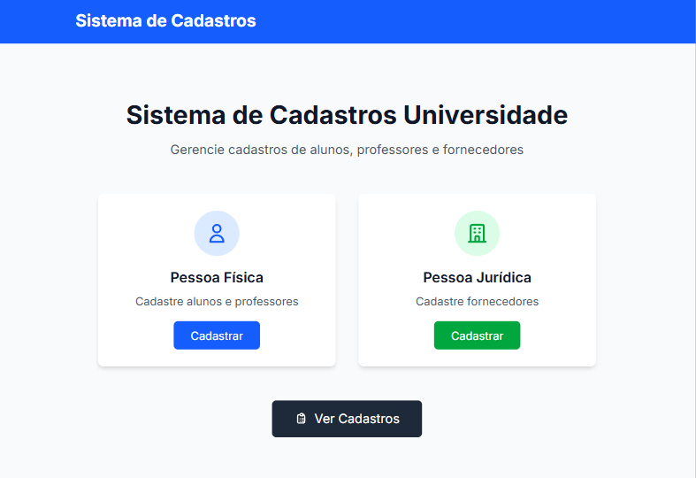

### 2. Seleção de Pessoa Física
**Arquivo**: `frontend/src/app/pessoa-fisica/page.tsx`
- Escolha entre cadastro de Aluno ou Professor
- Cards informativos com navegação

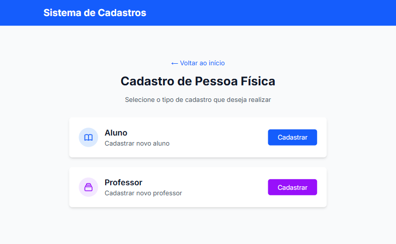

### 3. Cadastro de Aluno
**Arquivo**: `frontend/src/app/aluno/cadastro/page.tsx`
- Formulário completo para dados pessoais
- Campos específicos: RA, curso, período
- Validações em tempo real

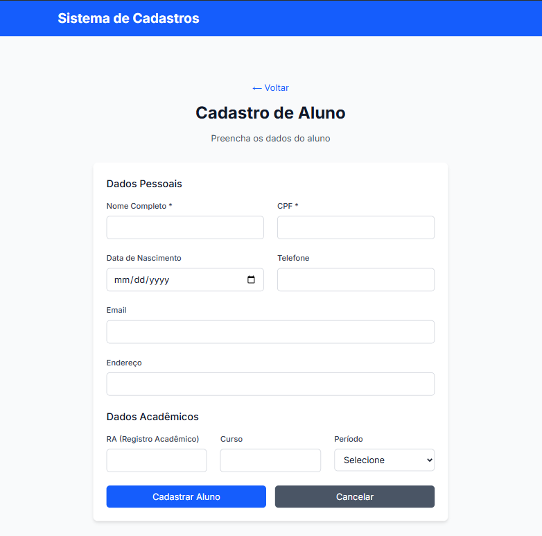

### 4. Cadastro de Professor
**Arquivo**: `frontend/src/app/professor/cadastro/page.tsx`
- Formulário para dados pessoais e profissionais
- Campos específicos: matrícula, departamento, especialidade, titulação
- Validações de negócio

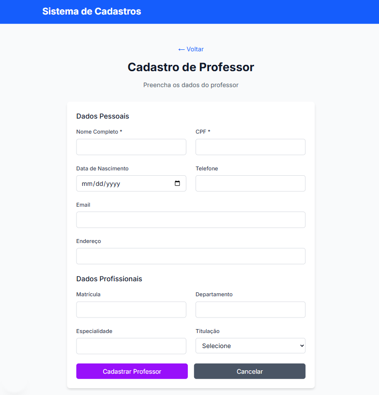

### 5. Cadastro de Fornecedor (Pessoa Jurídica)
**Arquivo**: `frontend/src/app/pessoa-juridica/page.tsx`
- Dados empresariais completos
- Informações de contato e área de fornecimento
- Validação de CNPJ

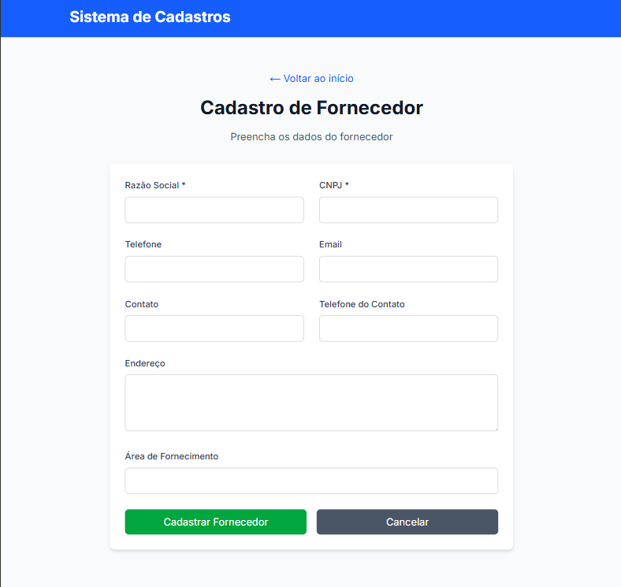

### 6. Listagem Geral
**Arquivo**: `frontend/src/app/listagem/page.tsx`
- Tabela responsiva com todos os cadastros
- Filtros por tipo: Alunos, Professores, Fornecedores
- Funcionalidades de exclusão e atualização

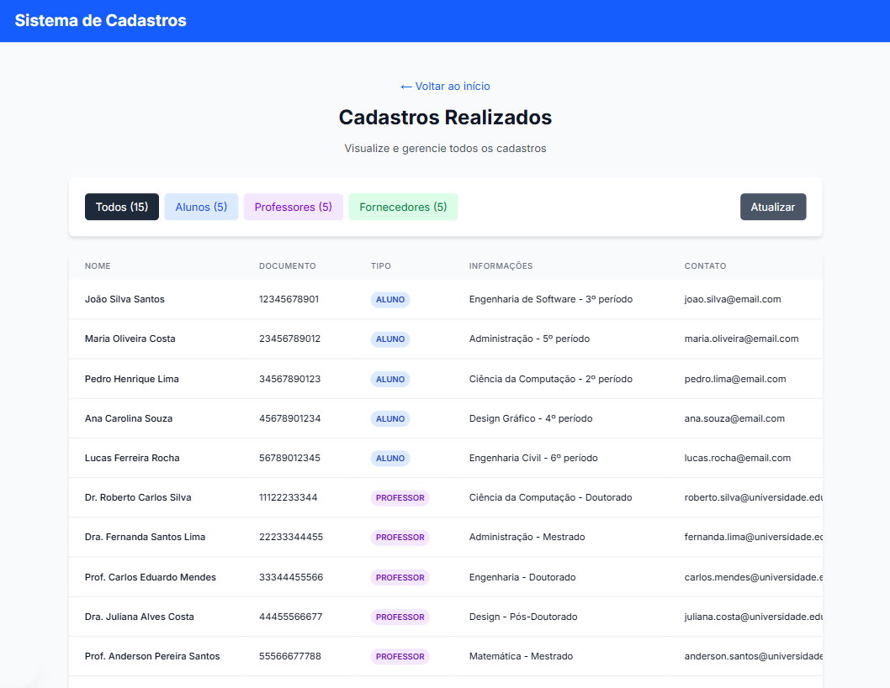

### 7. Filtro por Alunos
- Visualização específica dos alunos cadastrados
- Informações acadêmicas (RA, curso, período)

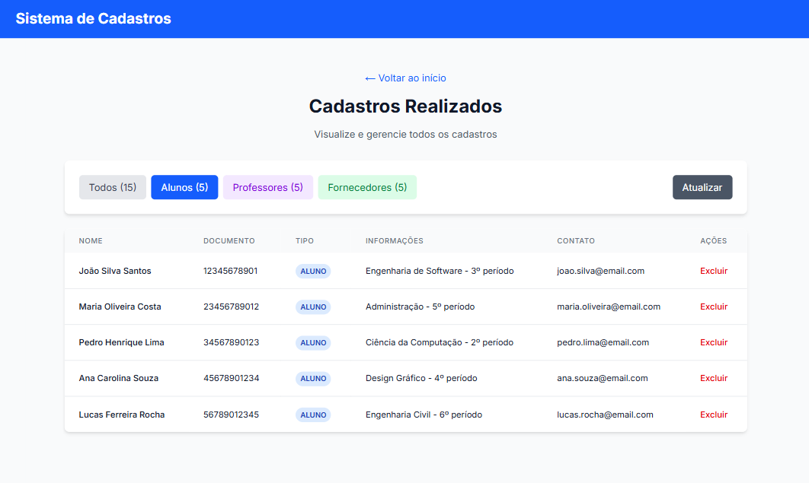

### 8. Filtro por Professores
- Visualização específica dos professores cadastrados
- Informações profissionais (matrícula, departamento, titulação)

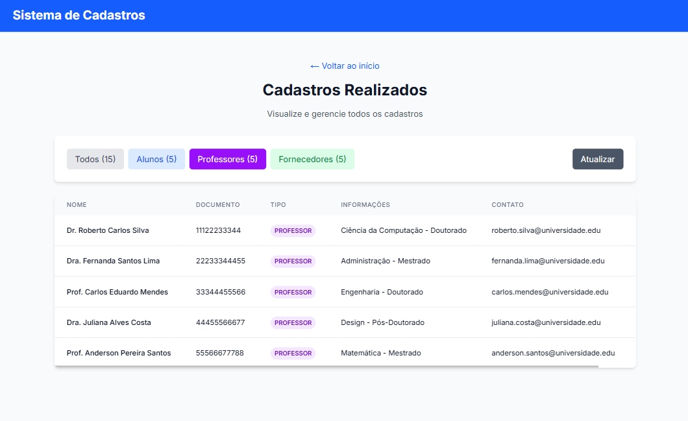

### 9. Filtro por Fornecedores
- Visualização específica dos fornecedores cadastrados
- Informações empresariais (CNPJ, área de fornecimento)

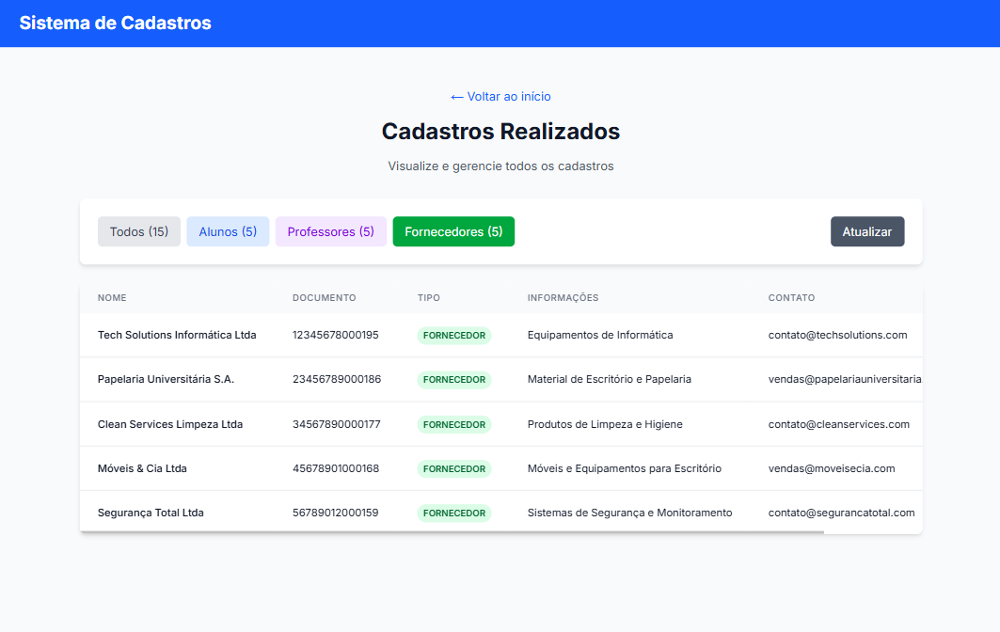

---

## 🔄 Fluxo de Telas

```
📱 Home (/)
├── 👤 Pessoa Física (/pessoa-fisica)
│   ├── 🎓 Cadastro Aluno (/aluno/cadastro)
│   └── 👨‍🏫 Cadastro Professor (/professor/cadastro)
├── 🏢 Pessoa Jurídica (/pessoa-juridica)
│   └── 📦 Cadastro Fornecedor
└── 📊 Listagem (/listagem)
    ├── 🔍 Filtro: Todos
    ├── 🔍 Filtro: Alunos
    ├── 🔍 Filtro: Professores
    └── 🔍 Filtro: Fornecedores
```

---

## 🔄 Fluxo de Dados

### **Arquitetura da API (Backend)**
```
📡 Controller Layer
├── PessoaFisicaController (/api/pessoas-fisicas)
└── PessoaJuridicaController (/api/pessoas-juridicas)
    ↓
🔧 Service Layer
├── PessoaFisicaService (Regras de negócio)
└── PessoaJuridicaService (Validações)
    ↓
🗄️ Repository Layer
├── PessoaFisicaRepository (JPA)
└── PessoaJuridicaRepository (JPA)
    ↓
💾 H2 Database (Em memória)
```

### **Comunicação Frontend-Backend**
```
🌐 Frontend (Next.js) → 📡 API REST (Spring Boot) → 💾 H2 Database
```

### **Endpoints da API**
- `GET /api/pessoas-fisicas` - Listar todas as pessoas físicas
- `GET /api/pessoas-fisicas/alunos` - Listar apenas alunos
- `GET /api/pessoas-fisicas/professores` - Listar apenas professores
- `POST /api/pessoas-fisicas` - Cadastrar pessoa física
- `PUT /api/pessoas-fisicas/{id}` - Atualizar pessoa física
- `DELETE /api/pessoas-fisicas/{id}` - Excluir pessoa física
- `GET /api/pessoas-juridicas` - Listar pessoas jurídicas
- `POST /api/pessoas-juridicas` - Cadastrar pessoa jurídica
- `PUT /api/pessoas-juridicas/{id}` - Atualizar pessoa jurídica
- `DELETE /api/pessoas-juridicas/{id}` - Excluir pessoa jurídica

---

## ⚙️ Como Executar o Projeto

### **Pré-requisitos**
- Java 17 ou superior
- Node.js 18 ou superior
- Git

### **🔧 Backend (API)**

**IDE Recomendada**: IntelliJ IDEA

1. **Clone o repositório**
   ```bash
   git clone https://github.com/mlzzi/desenvolvimento-de-sistemas-orientado-a-objetos.git
   cd sistema-cadastros
   ```

2. **Navegue para o diretório do backend**
   ```bash
   cd backend
   ```

3. **Execute a aplicação**
   ```bash
   # Via Maven
   ./mvnw spring-boot:run
   
   # Ou via IDE (IntelliJ)
   # Abra o projeto e execute SistemaCadastrosApplication.java
   ```

4. **Verificar se está funcionando**
   - API: `http://localhost:8080`
   - H2 Console: `http://localhost:8080/h2-console`
     - JDBC URL: `jdbc:h2:mem:universidade`
     - Username: `sa`
     - Password: *(vazio)*

### **🎨 Frontend (Interface Web)**

**IDE Recomendada**: Visual Studio Code

1. **Navegue para o diretório do frontend**
   ```bash
   cd frontend
   ```

2. **Instale as dependências**
   ```bash
   npm install
   ```

3. **Execute a aplicação**
   ```bash
   npm run dev
   ```

4. **Acesse a aplicação**
   - Frontend: `http://localhost:3000`

---

## 📊 Diagramas da Fase 1

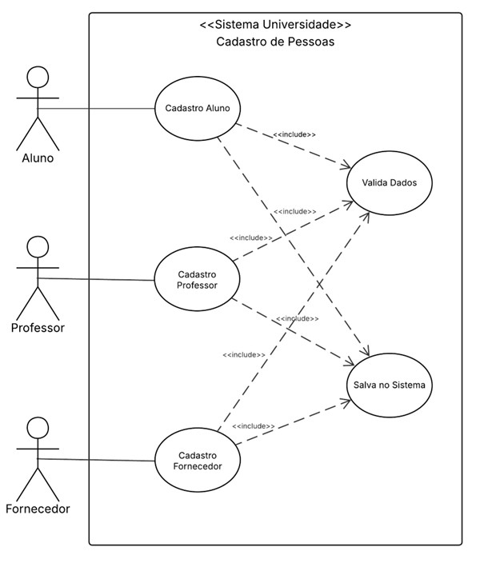  
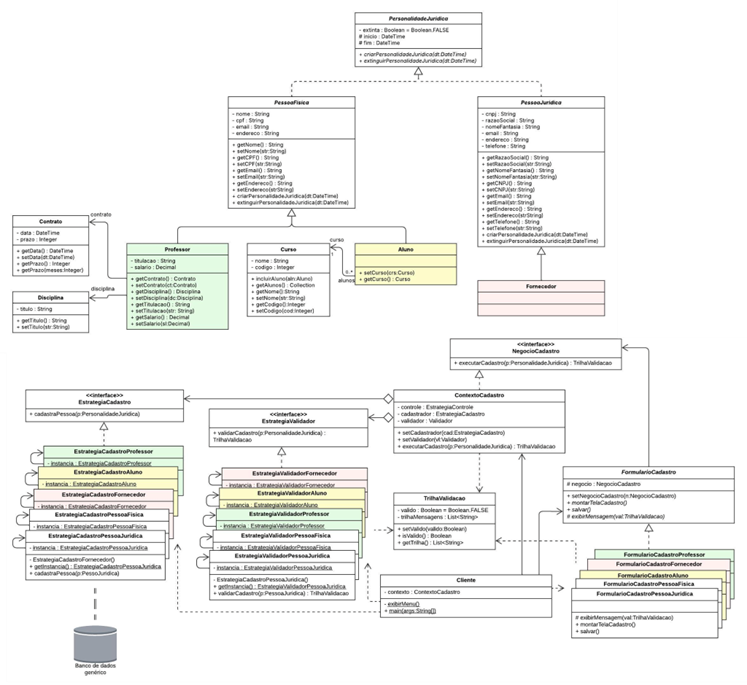

---

## 🗄️ Banco de Dados

### **Modelo Implementado**
- **pessoa_fisica**: Dados de alunos e professores
- **pessoa_juridica**: Dados de fornecedores
- **Relacionamentos**: Implementados via JPA/Hibernate
- **Constraints**: Chaves únicas e validações

### **Scripts Disponíveis**
📄 **[script.sql](./script.sql)** - Scripts completos do banco

### **Dados de Exemplo**

Execute no H2 Console para inserir dados de teste:

```sql
-- 5 Alunos de exemplo
INSERT INTO pessoa_fisica (nome, cpf, data_nascimento, endereco, telefone, email, tipo, ra, curso, periodo) VALUES
('João Silva Santos', '12345678901', '2000-05-15', 'Rua das Flores, 123', '11999887766', 'joao.silva@email.com', 'ALUNO', '2024001', 'Engenharia de Software', 3),
('Maria Oliveira Costa', '23456789012', '1999-08-22', 'Av. Paulista, 456', '11888776655', 'maria.oliveira@email.com', 'ALUNO', '2024002', 'Administração', 5);

-- 3 Professores de exemplo
INSERT INTO pessoa_fisica (nome, cpf, data_nascimento, endereco, telefone, email, tipo, matricula, departamento, especialidade, titulacao) VALUES
('Dr. Roberto Silva', '11122233344', '1975-04-12', 'Rua dos Professores, 100', '11444555666', 'roberto.silva@universidade.edu', 'PROFESSOR', 'PROF001', 'Ciência da Computação', 'Engenharia de Software', 'Doutorado');

-- 3 Fornecedores de exemplo
INSERT INTO pessoa_juridica (razao_social, cnpj, endereco, telefone, email, contato, telefone_contato, area_fornecimento) VALUES
('Tech Solutions Ltda', '12345678000195', 'Rua Comercial, 789', '1133334444', 'contato@techsolutions.com', 'Carlos Oliveira', '11987654321', 'Equipamentos de Informática');
```

---

## 📁 Estrutura do Projeto

```
sistema-cadastros/
├── 📂 backend/ (Backend - Spring Boot)
│   ├── src/main/java/com/universidade/sistema_cadastros/
│   │   ├── 📂 controller/ (Controladores REST)
│   │   ├── 📂 entity/ (Entidades JPA)
│   │   ├── 📂 repository/ (Repositórios de dados)
│   │   ├── 📂 service/ (Regras de negócio)
│   │   └── SistemaCadastrosApplication.java
│   ├── src/main/resources/
│   │   └── application.yaml (Configurações)
│   └── pom.xml (Dependências Maven)
│
├── 📂 frontend/ (Frontend - Next.js)
│   ├── src/app/
│   │   ├── 📂 aluno/cadastro/ (Cadastro de alunos)
│   │   ├── 📂 professor/cadastro/ (Cadastro de professores)
│   │   ├── 📂 pessoa-fisica/ (Seleção PF)
│   │   ├── 📂 pessoa-juridica/ (Cadastro PJ)
│   │   ├── 📂 listagem/ (Tabela com filtros)
│   │   ├── 📂 services/ (Comunicação com API)
│   │   └── page.tsx (Home)
│   ├── src/types/ (Tipos TypeScript)
│   ├── package.json
│   └── tailwind.config.js
│
├── 📂 prototipo/ (Imagens dos protótipos)
├── 📂 diagramas_1a_entrega/ (Diagramas UML)
├── script.sql (Scripts de exemplo)
└── README.md
```

---

## 🧪 Testando o Sistema

### **1. Teste Manual via Interface**
1. Acesse `http://localhost:3000`
2. Cadastre um aluno, professor e fornecedor
3. Vá para "Ver Cadastros" e teste os filtros
4. Teste as validações (CPF/CNPJ duplicados)

### **2. Verificação no Banco H2**
- Acesse o H2 Console
- Execute consultas SQL para verificar dados
- Teste integridade referencial

---

## 🔍 Funcionalidades Implementadas

### **✅ Cadastros**
- [x] Cadastro de Alunos (com RA, curso, período)
- [x] Cadastro de Professores (com matrícula, departamento, titulação)
- [x] Cadastro de Fornecedores (com área de fornecimento)

### **✅ Validações**
- [x] CPF único para pessoas físicas
- [x] CNPJ único para pessoas jurídicas
- [x] RA único para alunos
- [x] Matrícula única para professores
- [x] Validação de email
- [x] Campos obrigatórios

### **✅ Interface**
- [x] Design responsivo (mobile-first)
- [x] Navegação intuitiva
- [x] Feedback visual (loading, sucesso, erro)
- [x] Formulários com validação em tempo real

### **✅ Listagem e Filtros**
- [x] Tabela responsiva com todos os dados
- [x] Filtros por tipo (Aluno/Professor/Fornecedor)
- [x] Contadores por categoria
- [x] Funcionalidade de exclusão
- [x] Atualização automática

---

## 📌 Observações Técnicas

- **CORS configurado** para comunicação frontend-backend
- **Tratamento de erros** implementado em todas as camadas
- **Validações de negócio** centralizadas nos services
- **Código limpo** seguindo boas práticas Java e TypeScript
- **Responsividade** garantida com Tailwind CSS
- **Tipagem forte** com TypeScript no frontend
- **Banco H2** em memória para facilitar desenvolvimento e testes

---

## 🚀 Próximos Passos (Melhorias Futuras)

- [ ] Implementar autenticação e autorização
- [ ] Adicionar paginação na listagem
- [ ] Criar funcionalidade de edição inline
- [ ] Implementar busca por texto
- [ ] Adicionar relatórios em PDF
- [ ] Migrar para banco de dados persistente
- [ ] Implementar testes automatizados
- [ ] Deploy em ambiente de produção

---

## 📚 Referências

- FOWLER, M. UML essencial: um breve guia para a linguagem-padrão de modelagem de objetos. Porto Alegre: Bookman, 2005.
- LARMAN, C.; SALGADO, L. A. M. Utilizando UML e padrões: uma Introdução à Análise e ao Projeto Orientado a Objetos e ao Processamento Unificado. Porto Alegre: Bookman. 2000.
- PRESSMAN, R S. Engenharia de software. Rio de Janeiro: McGraw-Hill, 2006.
- SOMMERVILLE, Ian. Engenharia de software. 10. ed. São Paulo: Pearson, 2019.
- **Spring Boot Documentation**: https://spring.io/projects/spring-boot
- **Next.js Documentation**: https://nextjs.org/docs
- **Tailwind CSS Documentation**: https://tailwindcss.com/docs


**Desenvolvido com ❤️ pelo Grupo 16 - Senac**
